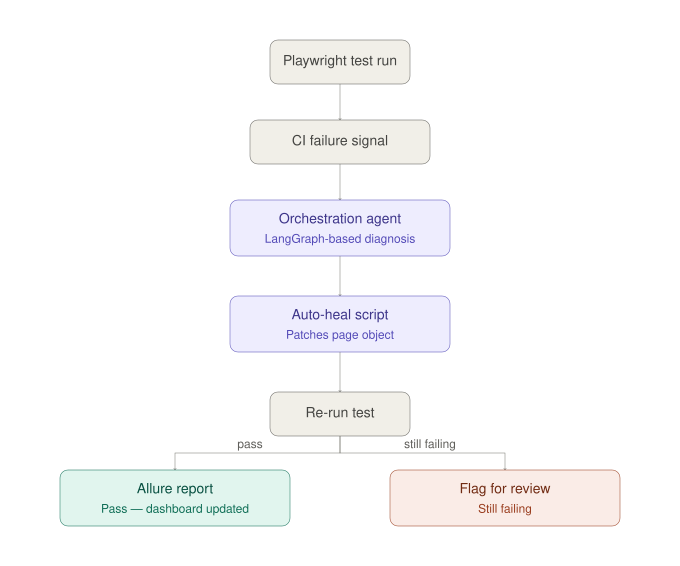

# PlaywrightScripting

**An AI-orchestrated, self-healing Playwright automation framework** — built
with TypeScript, LangGraph-based orchestration, and Allure 3 reporting.

This isn't just a Playwright starter kit. It's a layered system where CI
failures are diagnosed and auto-repaired by an orchestration agent before a
human ever has to touch a broken selector.

[](./LICENSE)
[](https://github.com/CoderAbb/PlaywrightScripting/actions/workflows/playwright.yml)
[](https://github.com/CoderAbb/PlaywrightScripting/actions/workflows/flaky-detection.yml)

---

## How it works



- **Failure detected** → a CI failure signal is raised from the Playwright run.
- **Orchestration agent** diagnoses the selector/auth issue (LangGraph-based).
- **Auto-heal script** patches the page object and the test re-runs.
- **Pass** → Allure 3 report + offline dashboard updated.
- **Still failing** → flagged for human review instead of silently retrying.

- **Auto-healing CI**: when a run fails on a broken selector or a stale
  session, an orchestration agent attempts to diagnose and patch it rather
  than just reporting red.
- **LangGraph orchestration**: coordinates multi-step diagnosis/repair flows
  instead of a single monolithic retry.
- **Allure 3 + offline HTML dashboard**: results are viewable without a
  hosted Allure server.
- **Prioritized selector strategy**: role/text-based selectors first, with
  fallbacks, to reduce brittleness in the first place.

> ⚠️ This project is under active development — see [Issues](../../issues)
> and [Discussions](../../discussions) for current direction.

---

## 🚀 Core features

- Playwright Test Runner with TypeScript
- Cross-browser automation (Chromium, Firefox, WebKit)
- Modern selectors (`getByRole`, `getByText`, `locator`)
- Auto-healing CI scripts for GitHub Actions
- LangGraph-based orchestration layer
- Allure 3 reporting + offline HTML dashboard
- Structured test flows (login → shop → cart → checkout)
- Reusable CLI login agent (Playwright MCP-based)
- Flaky test detection agent — scores tests across runs and classifies *why*
  they're flaky, not just *that* they are


## 📂 Project structure

```
PlaywrightScripting/
│
├── .github/workflows/     # CI pipelines (GitHub Actions)
├── tests/                 # Specs and page objects
├── jenkins-agent/         # Optional Jenkins integration
├── global-setup.ts        # Auth/session bootstrap
├── playwright.config.ts
└── package.json
```

## 🛠 Installation

Requires Node.js 18+.

```bash
git clone https://github.com/CoderAbb/PlaywrightScripting.git
cd PlaywrightScripting
npm install
npx playwright install
```

## ▶️ Running tests

```bash
npx playwright test              # full suite
npx playwright test --headed     # headed mode
npx playwright test tests/shoppingCheckout.spec.ts   # single spec
```

## 📊 Reports & tracing

```bash
npx playwright show-report       # HTML report
npx playwright test --trace on   # enable tracing
npx playwright show-trace trace.zip
```

Allure results are generated under `allure-results/` (gitignored) and
rendered into `allure-report/` — see [Allure docs](https://allurereport.org/)
for hosting the report as a static site (e.g. GitHub Pages) if you want a
shareable link.

## 🔍 Flaky test detection

```bash
npm test                  # produces test-results/results.json
npm run flaky              # score + classify flaky tests from this run + history
npm run flaky:quarantine   # also writes reports/quarantine-list.json
npm run flaky:strict       # exit 1 if any HIGH severity flaky test is found (for CI gating)
```

Each run is appended to `reports/flaky-history.json` (last 30 runs, gitignored
like the rest of `reports/`). `scripts/lib/flaky-detect.mjs` combines
in-run retry evidence with that history and routes anything above the
flakiness threshold through `graph/flakyTestAgent.mjs`, which classifies the
*cause* — `RACE_CONDITION`, `TIMING_SENSITIVE`, `NETWORK_DEPENDENT`,
`TEST_ISOLATION`, `ENVIRONMENTAL`, or `TRUE_BUG` (fails too consistently to
be flakiness at all) — with a concrete recommendation, the same
LangGraph-node pattern `failureRcaAgent.mjs` uses for failure RCA. That
same detector is also called from `npm run analyze`, so its results are
embedded in `reports/intelligence.json` (`flakyDetection`) and rendered as
their own "AI Flaky Detection" table in the `npm run dashboard` HTML report,
right alongside AI failure RCA — not just in a standalone report. The
standalone `reports/flaky-report.json` (from `npm run flaky` directly)
stays useful on its own for CI gating (`flaky:strict`) and quarantining
(`flaky:quarantine`); just don't run `flaky` immediately after `analyze` on
the same test run, or that run gets counted twice in the history.
The [`flaky-detection.yml`](.github/workflows/flaky-detection.yml) workflow
runs the standalone CLI on demand (or on a schedule you enable) and uploads
`flaky-report.json` as a build artifact.

## 🤝 Contributing

Contributions are welcome — see [CONTRIBUTING.md](./CONTRIBUTING.md) for
setup, conventions, and how to open a PR. Bug reports and feature ideas go
through [Issues](../../issues); open-ended questions go in
[Discussions](../../discussions).

## 📦 Recommended VS Code extensions

- Playwright Test for VS Code
- ESLint
- Prettier

## License

[MIT](./LICENSE)
