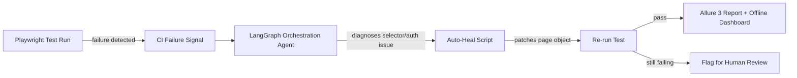

# PlaywrightScripting

**An AI-orchestrated, self-healing Playwright automation framework** — built
with TypeScript, LangGraph-based orchestration, and Allure 3 reporting.

This isn't just a Playwright starter kit. It's a layered system where CI
failures are diagnosed and auto-repaired by an orchestration agent before a
human ever has to touch a broken selector.

[](https://github.com/CoderAbb/PlaywrightScripting/actions)
[](./LICENSE)

---

## How it works



- **Auto-healing CI**: when a run fails on a broken selector or a stale
  session, an orchestration agent attempts to diagnose and patch it rather
  than just reporting red.
- **LangGraph orchestration**: coordinates multi-step diagnosis/repair flows
  instead of a single monolithic retry.
- **Allure 3 + offline HTML dashboard**: results are viewable without a
  hosted Allure server.
- **Prioritized selector strategy**: role/text-based selectors first, with
  fallbacks, to reduce brittleness in the first place.

> ⚠️ This project is under active development — see [Issues](../../issues)
> and [Discussions](../../discussions) for current direction.

---

## 🚀 Core features

- Playwright Test Runner with TypeScript
- Cross-browser automation (Chromium, Firefox, WebKit)
- Modern selectors (`getByRole`, `getByText`, `locator`)
- Auto-healing CI scripts for GitHub Actions
- LangGraph-based orchestration layer
- Allure 3 reporting + offline HTML dashboard
- Structured test flows (login → shop → cart → checkout)
- Reusable CLI login agent (Playwright MCP-based)

## 📂 Project structure

```
PlaywrightScripting/
│
├── .github/workflows/     # CI pipelines (GitHub Actions)
├── tests/                 # Specs and page objects
├── jenkins-agent/         # Optional Jenkins integration
├── global-setup.ts        # Auth/session bootstrap
├── playwright.config.ts
└── package.json
```

## 🛠 Installation

Requires Node.js 18+.

```bash
git clone https://github.com/CoderAbb/PlaywrightScripting.git
cd PlaywrightScripting
npm install
npx playwright install
```

## ▶️ Running tests

```bash
npx playwright test              # full suite
npx playwright test --headed     # headed mode
npx playwright test tests/shoppingCheckout.spec.ts   # single spec
```

## 📊 Reports & tracing

```bash
npx playwright show-report       # HTML report
npx playwright test --trace on   # enable tracing
npx playwright show-trace trace.zip
```

Allure results are generated under `allure-results/` (gitignored) and
rendered into `allure-report/` — see [Allure docs](https://allurereport.org/)
for hosting the report as a static site (e.g. GitHub Pages) if you want a
shareable link.

## 🤝 Contributing

Contributions are welcome — see [CONTRIBUTING.md](./CONTRIBUTING.md) for
setup, conventions, and how to open a PR. Bug reports and feature ideas go
through [Issues](../../issues); open-ended questions go in
[Discussions](../../discussions).

## 📦 Recommended VS Code extensions

- Playwright Test for VS Code
- ESLint
- Prettier

## License

[MIT](./LICENSE)
