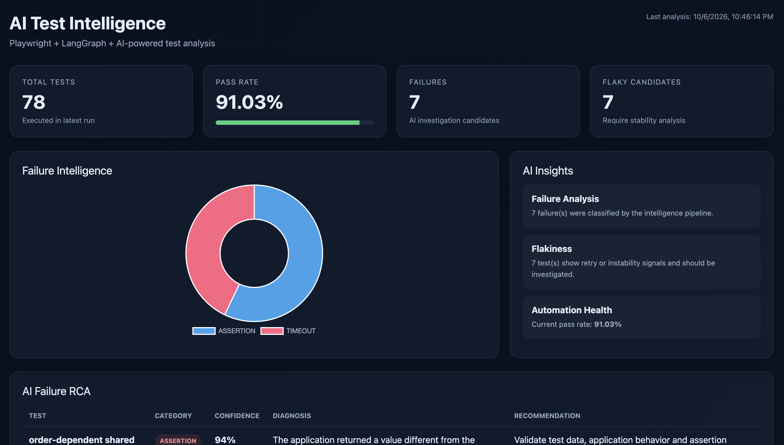

# 📘 PlaywrightScripting

**AI-orchestrated end-to-end test automation with Playwright, TypeScript, and LangGraph.**

[](https://github.com/CoderAbb/PlaywrightScripting/actions/workflows/pipeline.yml)




Started as a straightforward Playwright + TypeScript automation project and has grown into a
self-healing test framework: it runs your suite, classifies *why* each test failed, auto-fixes
what's safe to auto-fix, and flags what isn't — with a live dashboard showing the full picture.

---

## 🚀 What this is

✔ Playwright Test Runner with TypeScript, cross-browser (Chromium, Firefox, WebKit)
✔ Structured test flows (login → shop → cart → checkout) with modern selectors (`getByRole`, `getByTestId`, `getByText`)
✔ **AI-powered failure triage** — every failure is classified (timeout vs. assertion) and diagnosed with a confidence score and a recommendation
✔ **Self-healing CI** — syntax/type errors and broken locators are auto-fixed and verified; genuine behavior regressions are never auto-fixed, only flagged for human review
✔ **Flaky test detection** — tests that fail then pass on retry are surfaced as flaky candidates, not silently ignored
✔ **AI Test Intelligence dashboard** — pass rate, failure breakdown, RCA table, and flaky candidates in one view
✔ CI integration for both GitHub Actions and Jenkins
✔ HTML reports, Allure reporting, and full trace viewer support

---

## 🧠 How the self-healing pipeline works

Three categories of "broken," three different responses:

| Failure type | Example | What happens |
|---|---|---|
| **Syntax / type error** | A `.ts`/`.mjs` file doesn't compile | Auto-fixed by `auto-heal.mjs`, re-verified, before tests even run |
| **Locator-class failure** | `locator.click: Timeout 10000ms exceeded` | Auto-fixed by `heal-locators.mjs` using a role → testid → label → text priority ladder, then the spec is re-run to confirm the fix actually works |
| **Assertion-class failure** | App returned a value different from what the test expected | **Never auto-fixed.** This might mean the app's behavior genuinely changed — "fixing" the assertion could silently hide a real regression. Instead it's written to a `reports/needs-human-review-*.md` file for manual review |

The orchestrator that chains all of this together is `scripts/pipeline.mjs` — one command that runs the
suite, classifies every failure, applies the safe fixes, and tells you exactly what still needs eyes on it.

---

## 📂 Project Structure

```
PlaywrightScripting/
├── tests/
│   ├── checkout.spec.ts
│   ├── newtest.spec.ts
│   └── flaky.spec.ts
│
├── scripts/
│   ├── auto-heal.mjs              # TypeScript/JS syntax auto-fixer (pre-test gate)
│   ├── heal-locators.mjs          # Locator-failure healer, verified by re-run
│   ├── pipeline.mjs               # End-to-end orchestrator (run -> classify -> heal -> report)
│   ├── detect-flaky-tests.mjs     # Flaky candidate detection
│   ├── analyze-results.mjs        # AI RCA / failure analysis
│   └── lib/
│       └── automation-state.mjs   # Shared run-state tracking
│
├── .github/
│   └── workflows/                 # GitHub Actions CI pipelines
│
├── jenkins-agent/                 # Jenkins agent config
├── jenkins-config.xml
│
├── allure-results/
├── allure-report/
│
├── global-setup.ts
├── playwright.config.ts
├── tsconfig.json
├── package.json
└── README.md
```

---

## 🛠 Installation

Requires Node.js 18+.

```bash
git clone https://github.com/CoderAbb/PlaywrightScripting.git
cd PlaywrightScripting
npm install
npx playwright install
```

For the AI-powered scripts (auto-heal, heal-locators, RCA analysis), set an Anthropic API key:

```bash
export ANTHROPIC_API_KEY=sk-...
```

---

## ▶️ Running Tests

```bash
npx playwright test                          # full suite
npx playwright test --headed                  # headed mode
npx playwright test tests/checkout.spec.ts     # a specific spec
```

## 🩺 Running the self-healing pipeline

```bash
npm run pipeline              # run, classify, auto-heal, report
npm run pipeline:dry-run      # same, but don't write any fixes
npm run pipeline:pr           # auto-heal, then open a PR instead of committing locally
```

Individual pieces can also be run on their own:

```bash
npm run heal:detect           # syntax check only, no API key needed
npm run heal                  # auto-fix syntax/type errors
npm run heal-locators:dry-run # preview locator fixes without applying
npm run heal-locators         # fix + verify locator failures
npm run flaky                 # detect flaky candidates (needs --retries on the run that fed it)
npm run intelligence          # analyze + render the dashboard
```

## 📊 Dashboard & Reports

```bash
npm run dashboard             # render the AI Test Intelligence dashboard
npx playwright show-report    # standard Playwright HTML report
npx playwright test --trace on && npx playwright show-trace trace.zip
```

The dashboard shows total tests, pass rate, a timeout/assertion failure breakdown, an AI-generated
root-cause table per failure (category, confidence, diagnosis, recommendation), and the current
flaky-candidate list.

---

## 📦 Recommended VS Code Extensions

- Playwright Test for VS Code
- ESLint
- Prettier

---

## 🗺 Roadmap

- [ ] Quarantine tests that stay flaky across N consecutive runs instead of re-healing every time
- [ ] Wire the dashboard's "Investigate" action to open the relevant trace file
- [ ] Persist flaky/failure history across runs for trend tracking
